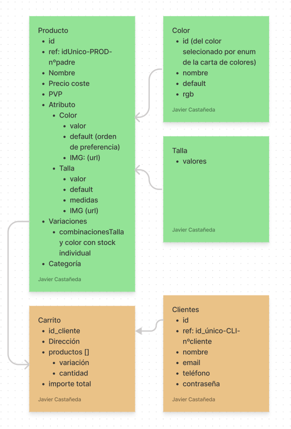

# Modas la caprichosa
### 1. DESCRIPCIÓN DEL PROYECTO:

ésta aplicación nació con el objetivo de automatizar el proceso de introducción de nuevas prendas en una tienda de ropa, donde la rotación de nuevos productos es muy alta, y es de vital importancia la automatización para poder garantizar el retorno de la inversión, en la creaciónde una tienda online.

### 2. FUNCIONALIDADES:
2a introducen los datos en señoritacaprichosa.com y de forma automática los datos se introducen en la tienda física y en la tienda online, así como la posterior sincronización de los datos

2b. una vez introducidos los datos, será necesario sincronizar los stock de la tienda física y la tienda online. (independientemente del software que use la tienda física, y el modelo de la tienda online (woocommerce, prestashop, Shopyfy o cualquier otro)

2c. las etiquetas con código de barras se generan de forma automática, antes incluso de dar de alta el producto en el servidor, con el objetivo de reducir costes de mano de obra en el momento de etiquetar.

### 3. TECNOLOGÍAS EMPLEADAS:
Backend: Node
- dependencias de desarrollo:
-- nodemoon para subir el servidor cuando hago modificaciones
-- prettier

-dependencias de producción
-- Express.js para ¿ver la página?
-- dotenv para crear las varables de ambiente
--jsonwebtoken para las rutas privadas
--moment (aunque lo cambiaré por otro paquete que pese menos)
--mongo (ATLAS) Base de datos no relacional en la nuve
--mongoose "haciendo la vida mas fácil para trabajar con mongo"

### 4. DESCRIPCIÓN TÉCNICA DEL PROYECTO 

``` Constará de los siguientes modelos ``` 

##### PRODUCTOS:
- ref(para ayudar a hacer debugging)
- Nombre
- precio Coste
- PVP
- Atributo (Color y talla, que a su vez serán  modelos propios)
- Variaciones (a partid de todas las combinaciones posibles de color y talla)
- Categoría


##### CARRITO
- id_cliente
- dirección
- productos [variación y cantidad]
- importe total


##### Clientes
- id_cliente
- ref: 
- nombre
- email
- teléfono
- contraseña


``` mas información en:   ```
[figma]
{width='100px'}

[figma]: <https://www.figma.com/file/B9OXv0ezwkKf9i32PyH2yf/modas-la-caprichosa?node-id=0%3A1 "TENGO QUE CONSEGUIR COLOCAR EL TÍTULO AQUÍ">

### 5. Versión
0.5.0

### 6. To Do
crear aplicación de escritorio para leer la base de datos del programa que estén usando de la tienda física
dominar la api de woocommerce para actualizar la información
hacer testing con cypress para garantizar que los stocks son correctos
crear aplicación para subir las fotos con mas facilidad desde el móvil al escanear un código de barras y hacer la foto
servidor de fotos, para tener las fotos desde una url, y de ésta forma trabajar de forma mas fácil
modificar el producto por defecto así como la foto por defecto.(si la imágen principal de una colección de faldas es una falda verde y ya se vendió, que de forma automática asigne por defecto la siguiente, y que no aparezaca en la web)

que las etiquetas salgan por la impresora sin nisiquiera tener que hacer Ctrl+P

crear productos relacionados
insertar los gustos y las medidas de la persona, para poder ofrecerle productos qeu le gusten, ylos pueda llevar
crear la tabla de tallage de cada proveedor, con la correspondiente estandarización, para poder relacionarlo con las medidas de cada clienta

en caso qeu una prenda no valga para una persona, que lo avise

hacer dropShiping, vender de forma dinámica productos que no tenemos.
fabricación a medida:  diseñalo en tu imaginación que nosotras lo hacemos realidad, no es un sueño, es una realidad señorita caprichosa

introducción de la dirección de envío de la clienta con marcador de su casa, marcador del trabajo, colocar horas de forma dinámica del momento de recogida (poer compartir el enlace para que lo recoja otra persona,)
mapa compartir tiempo real, pesona que recoge y que entrega
subir los datos de forma automática a la empresa de reparto
enlace del repartidor, para enviar el mensaje
mostrar por donde va el vehículo con el paquete y el histórico, además de la fecha prevista de entrega (calculando sábados domingos festivos, y características de cada empresa de reparto)

Pendiente consultar la mejor empresa de reparto: hacer scraping a PC Componentes qeu en función del lugar de envío, seleccionan una empresa de paquetería u otra

alertas personalizadas: 
medio whatsAppa, instagram Facebookmessenger SMS email
frecuencia  semanal, mensual, diaria, instantánea(desde qeu llegue éste producto, notificación y lo compro antes qeu me lo quiten)
hora de envío
contenido


tener categoría y etiqueta(con un nombre que no confunda a la pegatina de la prenda)

insertar GraphQL para mostrar la información cuando escale
https://cloudinary.com/  para mostra las imágenes a partir de una url
multer ¿es útil?